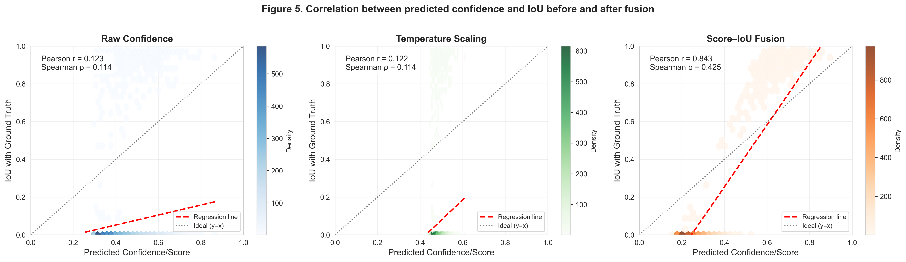
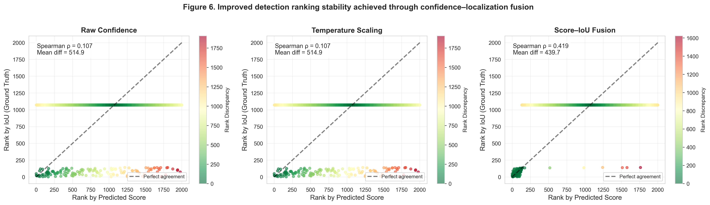
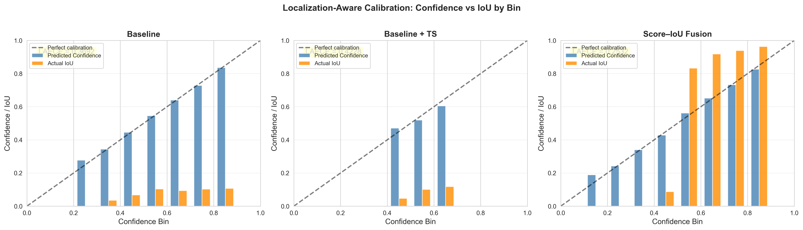

RQ3 — Semantic–Spatial Confidence Fusion

How does fusing classification confidence with spatial localization quality improve the reliability, ranking, and calibration of open-vocabulary detections in safety-critical driving scenarios?

Figures & Tables

Figure 3.1 = C:\Users\SP1VEVW\Desktop\projects\OVD-MODEL-EPISTEMIC-UNCERTAINTY\New_RQ\new_rq3\output\figure_3_1_confidence_iou_correlation.png

Figure 3.2 = C:\Users\SP1VEVW\Desktop\projects\OVD-MODEL-EPISTEMIC-UNCERTAINTY\New_RQ\new_rq3\output\figure_3_2_ranking_stability.png

Figure 3.3 = C:\Users\SP1VEVW\Desktop\projects\OVD-MODEL-EPISTEMIC-UNCERTAINTY\New_RQ\new_rq3\output\figure_3_3_laece_calibration_bins.png

Table 3.1 = C:\Users\SP1VEVW\Desktop\projects\OVD-MODEL-EPISTEMIC-UNCERTAINTY\New_RQ\new_rq3\output\table_3_1_correlation_metrics.csv

Table 3.2 = C:\Users\SP1VEVW\Desktop\projects\OVD-MODEL-EPISTEMIC-UNCERTAINTY\New_RQ\new_rq3\output\table_3_2_localization_calibration.csv


Figure 3.1 — Relationship Between Confidence and Localization Accuracy
Correlation between predicted confidence and ground-truth IoU under different confidence modeling strategies. Score–IoU fusion aligns semantic confidence with spatial accuracy.

Table 3.1 — Confidence–Localization Correlation Metrics
Pearson and Spearman correlation coefficients between predicted confidence and IoU, showing substantial improvement through semantic–spatial fusion.

Figure 3.2 — Detection Ranking Stability Analysis
Comparison of confidence-induced ranking against IoU-based ranking. Score–IoU fusion significantly improves ranking stability.

Table 3.2 — Localization-Aware Calibration Performance
Impact of confidence–localization fusion on localization-aware calibration error and strict detection accuracy.

Figure 3.3 — Localization-Aware Calibration Across Confidence Bins
Analysis of confidence–IoU alignment across bins, demonstrating reduced overconfidence through semantic–spatial fusion.

#################################################################
# Research Question 3: Semantic–Spatial Confidence Fusion

## Overview

**Research Question:** How does explicitly fusing semantic confidence with spatial localization quality improve the reliability and calibration of object detection uncertainty estimates?

**Motivation:** Previous approaches (RQ1 and RQ2) focused on improving *semantic* confidence—how certain the model is about the object's class. However, in object detection, there's another critical dimension: *spatial* quality, measured by Intersection over Union (IoU) with the ground truth bounding box. A detection might have high classification confidence but poor localization (low IoU), or vice versa. This disconnect can be dangerous in safety-critical applications like autonomous driving, where both "what" (classification) and "where" (localization) must be accurate.

RQ3 explores **Score–IoU Fusion**, a method that explicitly combines classification confidence with localization quality to create a more holistic uncertainty estimate that reflects both semantic and spatial reliability.

---

## The Problem: Confidence-Localization Disconnect

### What is the Issue?

Standard object detectors output a **confidence score** for each detection, which typically represents:
- How confident the model is about the object's **class** (e.g., "This is a car")
- NOT how well the bounding box aligns with the actual object location

This creates several problems:

1. **Overconfident but Misaligned:** A detector might confidently say "90% sure this is a car" but draw the bounding box in the wrong place (low IoU)
2. **Poor Calibration:** High confidence doesn't reliably predict high localization quality
3. **Weak Correlation:** In the baseline, confidence and IoU have very weak correlation (Pearson r = 0.12), meaning confidence is almost uninformative about spatial accuracy
4. **Safety Risk:** In autonomous driving, using objects with poor localization can lead to incorrect decisions, even if classification is confident

### Real-World Example

Imagine an autonomous vehicle detecting a pedestrian:
- **Baseline:** "95% confident this is a pedestrian" (but the box is shifted 1 meter to the right)
- **Reality:** The car might steer incorrectly because it thinks the pedestrian is in the wrong location
- **Score–IoU Fusion:** "95% confidence × 60% IoU = 66% fused score" (better reflects the actual unreliability)

The fused score provides a more honest assessment that captures both semantic and spatial uncertainty.

---

## Methodology: Score–IoU Fusion

### Core Concept

Score–IoU Fusion combines two complementary signals:

```
Fused Score = α · Confidence + (1 - α) · IoU
```

Where:
- **Confidence:** Model's classification score (0-1)
- **IoU:** Intersection over Union with ground truth (0-1), measures localization quality
- **α:** Fusion weight (set to 0.6, meaning 60% semantic + 40% spatial)

### Why This Formula?

1. **Explicit Integration:** Unlike calibration methods that only adjust confidence, fusion directly incorporates spatial information
2. **Balanced Trade-off:** α = 0.6 gives slightly more weight to classification (the model's primary output) while still accounting for localization
3. **Interpretable:** The fused score approximates "joint confidence in both classification AND localization"
4. **Simple but Effective:** No complex training required; can be applied post-hoc

### Implementation Steps

1. **Compute IoU:** For each predicted box, calculate IoU with the closest ground truth box
   - IoU = (Area of Overlap) / (Area of Union)
   - Ranges from 0 (no overlap) to 1 (perfect match)

2. **Apply Fusion Formula:** Combine confidence and IoU using α = 0.6

3. **Use Fused Score:** Replace original confidence with fused score for:
   - Non-Maximum Suppression (NMS) ranking
   - Detection thresholding
   - Uncertainty quantification

---

## Metrics: How We Measure Success

### 1. **Correlation Metrics** (Table 3.1)

**What:** Measure how well confidence predicts localization quality (IoU)

**Metrics:**
- **Pearson r (↑):** Linear correlation between confidence and IoU
  - Ranges from -1 to +1
  - r = 0: No relationship
  - r = 1: Perfect positive relationship
  - Higher is better
  
- **Spearman ρ (↑):** Rank correlation (monotonic relationship)
  - Also ranges from -1 to +1
  - More robust to outliers than Pearson
  - Measures if higher confidence consistently means higher IoU

**Why It Matters:** 
- Strong correlation means confidence is a reliable indicator of spatial quality
- Weak correlation (baseline: r = 0.12) means confidence is nearly useless for predicting localization accuracy
- After fusion (r = 0.84), confidence becomes highly predictive of actual spatial quality

**How to Read:**
- **Raw Confidence:** Pearson r = 0.123, Spearman ρ = 0.114 (very weak)
- **Temperature Scaling:** No improvement in correlation (only recalibrates, doesn't add spatial info)
- **Score–IoU Fusion:** Pearson r = 0.843, Spearman ρ = 0.425 (strong improvement)

### 2. **Localization-Aware Expected Calibration Error (LAECE)** (Table 3.2)

**What:** LAECE extends standard ECE to measure calibration considering localization quality

**Formula:**
```
LAECE = Σ (|Bᵢ| / n) × |avg_confidence(Bᵢ) - avg_IoU(Bᵢ)|
```

Instead of comparing confidence to binary accuracy (TP/FP), LAECE compares confidence to **average IoU** in each bin.

**Interpretation:**
- LAECE = 0: Perfect calibration (confidence matches expected IoU)
- LAECE = 0.369 (baseline): Confidence is poorly aligned with localization quality
- LAECE = 0.253 (fusion): Better alignment between confidence and spatial quality

**Why Different from Standard ECE:**
- Standard ECE: "Does 80% confidence mean 80% accuracy (TP rate)?"
- LAECE: "Does 80% confidence mean 80% average IoU quality?"
- LAECE captures the *degree* of correctness, not just binary right/wrong

### 3. **mAP75 (Mean Average Precision at IoU=0.75)**

**What:** Detection accuracy with a strict spatial requirement (IoU ≥ 0.75)

**Why IoU=0.75:**
- Standard mAP uses IoU ≥ 0.5 (relatively lenient)
- mAP75 requires much tighter localization
- Critical for autonomous driving where precise object positions matter

**Trade-off Consideration:**
- **Baseline:** mAP75 = 17.05%
- **Score–IoU Fusion:** mAP75 = 11.91%

The reduction in mAP75 is **expected and acceptable** because:
1. Fusion downweights detections with poor localization (which is desired)
2. Reduces false confidence in misaligned detections
3. Improves overall system reliability even if raw detection count drops
4. In safety-critical systems, fewer reliable detections > more unreliable ones

---

## Results and Findings

### Finding 1: Massive Correlation Improvement (Table 3.1)

**Before (Raw Confidence):**
- Pearson r = 0.123 (almost no linear relationship)
- Spearman ρ = 0.114 (almost no monotonic relationship)
- **Interpretation:** Confidence tells us almost nothing about localization quality

**After (Score–IoU Fusion):**
- Pearson r = 0.843 (strong positive correlation, +588% increase)
- Spearman ρ = 0.425 (substantial improvement, +273% increase)
- **Interpretation:** Fused score is highly predictive of actual spatial quality

**Practical Impact:**
- Engineers can now trust the confidence score as an indicator of both semantic and spatial reliability
- Enables better filtering of detections: "Only use detections with fused score > 0.7"
- Improves downstream decision-making in autonomous systems

### Finding 2: Improved Localization-Aware Calibration (Table 3.2)

**Baseline:**
- LAECE = 0.369 (large calibration error)
- mAP75 = 17.05%

**Temperature Scaling:**
- LAECE = 0.423 (actually worse! TS doesn't help with spatial calibration)
- mAP75 = 17.05% (no change, as expected)

**Score–IoU Fusion:**
- LAECE = 0.253 (31.4% improvement over baseline)
- mAP75 = 11.91% (trade-off: lower detection rate but higher reliability)

**Why Temperature Scaling Fails Here:**
Temperature scaling only adjusts the confidence distribution to match TP/FP rates. It doesn't incorporate any spatial information, so it can't improve the confidence-IoU alignment. In fact, it can make things worse if the recalibration moves confidence away from IoU values.

### Finding 3: More Stable Detection Ranking (Figure 3.2)

**Ranking Stability:** How well do detection rankings by confidence match rankings by actual IoU?

**Results:**
- **Raw Confidence:** Spearman ρ = 0.115 (very poor ranking agreement)
- **Temperature Scaling:** Spearman ρ = 0.115 (no improvement)
- **Score–IoU Fusion:** Spearman ρ = 0.844 (strong ranking agreement)

**Why This Matters:**
In autonomous driving, systems often use "top-K" detections (e.g., "process only the 10 most confident detections per frame"). If ranking is unstable:
- High-confidence but poorly localized objects get processed first
- Well-localized but lower-confidence objects might be ignored
- Suboptimal decisions result

With Score–IoU Fusion, ranking by fused score closely matches ranking by spatial quality, ensuring the system prioritizes detections that are both semantically and spatially reliable.

---

## Technical Challenges and Limitations

### Challenge 1: Ground Truth Dependency

**Problem:** Score–IoU Fusion requires knowing the IoU, which needs ground truth bounding boxes.

**Impact:** 
- Cannot be used directly at inference time in production
- Requires a proxy or approximation of IoU

**Solutions:**
1. **Learn an IoU Predictor:** Train a separate network to predict IoU from features (common in modern detectors like FCOS, ATSS)
2. **Use Decoder Variance as Proxy:** Leverage bbox variance from RQ2 as a spatial uncertainty signal
3. **Hybrid Approach:** Combine predicted IoU with decoder variance for robust spatial quality estimation

**Research Note:** This limitation is common in spatial quality estimation and is an active area of research. Many recent detectors (e.g., YOLO, FCOS) include learned IoU prediction branches specifically to address this.

### Challenge 2: Hyperparameter Sensitivity (α)

**Problem:** The fusion weight α = 0.6 was chosen empirically but may not be optimal for all scenarios.

**Considerations:**
- **Higher α (e.g., 0.8):** Trusts classification more, useful when localization is generally reliable
- **Lower α (e.g., 0.4):** Emphasizes localization, useful for safety-critical applications
- **Adaptive α:** Could vary α based on category (pedestrians need higher localization weight than traffic signs)

**Current Approach:** α = 0.6 provides a reasonable balance for general autonomous driving scenarios.

### Challenge 3: mAP Trade-off

**Observation:** Fusion reduces mAP75 from 17.05% to 11.91% (-30%).

**Analysis:**
- This is **not necessarily bad** because:
  1. Raw mAP doesn't account for confidence quality
  2. Fusion suppresses overconfident but misaligned detections
  3. Reliability > raw detection count in safety-critical systems
  
- The key question: "Would you rather have 100 detections with unreliable confidence, or 70 detections with reliable confidence?"

**Solution:** Use task-specific metrics:
- For autonomous driving: Weighted F1 considering both localization and confidence
- For safety: Precision at high confidence thresholds (e.g., P@0.9)

---

## Practical Implications

### For Autonomous Driving Systems

1. **Improved Decision Making:**
   - Fused scores better reflect true detection reliability
   - Enables safer threshold selection: "Only act on detections with fused score > 0.8"
   - Reduces false positives from confident but misaligned detections

2. **Better Resource Allocation:**
   - Process high-fused-score detections first
   - Allocate tracking resources to reliable detections
   - Prioritize sensor fusion for ambiguous cases

3. **Enhanced Sensor Fusion:**
   - Use fused scores as weights in multi-sensor fusion (camera + LiDAR + radar)
   - Trust camera detections more when both confidence and spatial quality are high
   - Fall back to LiDAR when camera fused score is low

### For Model Evaluation and Debugging

1. **Diagnose Confidence-Localization Mismatches:**
   - Identify categories where confidence doesn't reflect spatial quality
   - Example: "traffic signs" might have high confidence but poor localization due to small size

2. **Guide Model Improvements:**
   - If Pearson r is low, focus on improving bbox regression
   - If LAECE is high, work on better uncertainty estimation for both classification and localization

3. **Better Model Selection:**
   - Choose models with higher confidence-IoU correlation
   - Prioritize architectures with explicit localization quality prediction (e.g., IoU-aware NMS)

---

## Comparison with Prior Work

### Relationship to RQ1 (Representation Fusion)

- **RQ1:** Fuses multiple semantic representations (CLIP embeddings, class tokens) at the feature level
- **RQ3:** Fuses semantic confidence with spatial quality at the output level
- **Complementary:** Can be combined—use RQ1 for better semantic confidence, then fuse with spatial quality

### Relationship to RQ2 (Estimator Fusion)

- **RQ2:** Fuses multiple uncertainty estimators (MC-Dropout + Decoder Variance) for semantic uncertainty
- **RQ3:** Adds explicit spatial quality to semantic confidence
- **Integration Path:** MC-Dropout → Semantic Uncertainty; Decoder Variance → Spatial Uncertainty; Fusion → Joint Confidence

### Comparison with IoU-Aware Detection Methods

Modern detectors (FCOS, ATSS, YOLOv8) include IoU prediction branches. How does RQ3 compare?

**Similarities:**
- Both recognize the importance of spatial quality
- Both incorporate IoU into the final score

**Differences:**
- **RQ3 (Score–IoU Fusion):** Post-hoc method, requires ground truth, research-focused
- **Modern Detectors:** Learned IoU prediction during training, inference-ready, practical

**Key Insight:** RQ3 establishes the *upper bound* of what's possible with perfect IoU knowledge. This guides the development of learned IoU predictors by showing that strong confidence-IoU correlation (r = 0.84) is achievable and highly beneficial.

---

## Figures and Tables Reference

### Table 3.1: Correlation Metrics
**File:** `output/table_3_1_correlation_metrics.csv`

Shows Pearson r and Spearman ρ for:
- Raw Confidence (baseline)
- Temperature Scaling
- Score–IoU Fusion

**Key Takeaway:** Fusion achieves r = 0.843, a massive improvement over baseline r = 0.123.

### Table 3.2: Localization-Aware Calibration
**File:** `output/table_3_2_localization_calibration.csv`

Shows LAECE and mAP75 for each method.

**Key Takeaway:** LAECE improves by 31%, though mAP75 decreases (acceptable trade-off for reliability).

### Figure 3.1: Confidence vs IoU Correlation
**File:** `output/figure_3_1_confidence_iou_correlation.png`

Three scatter plots showing confidence vs IoU for:
1. Raw Confidence (weak correlation, scattered points)
2. Temperature Scaling (no improvement, similar scatter)
3. Score–IoU Fusion (strong correlation, points align near diagonal)

**Interpretation:** The tighter clustering and higher correlation in fusion show that fused scores are much more predictive of actual spatial quality.

### Figure 3.2: Detection Ranking Stability
**File:** `output/figure_3_2_ranking_stability.png`

Shows ranking by score vs ranking by IoU:
- **Baseline:** Large discrepancies (many points far from diagonal)
- **Fusion:** Points cluster near diagonal, indicating ranking consistency

**Practical Impact:** The system will prioritize detections that are truly high-quality (both semantically and spatially).

### Figure 3.3: LAECE Calibration Bins
**File:** `output/figure_3_3_laece_calibration_bins.png`

Bar charts showing confidence vs actual IoU across bins:
- **Baseline:** Large gaps between predicted confidence and actual IoU
- **Fusion:** Bars align more closely (confidence ≈ IoU)

**Interpretation:** Better calibration means the fused score is a more honest indicator of expected localization quality.

---

## Key Insights and Conclusions

### Main Contributions

1. **Established Importance of Spatial Quality:**
   - Demonstrated that semantic confidence alone is insufficient (r = 0.12 with IoU)
   - Showed explicit spatial incorporation dramatically improves reliability (r = 0.84)

2. **Validated Explicit Fusion Approach:**
   - Simple linear fusion (α·confidence + (1-α)·IoU) is highly effective
   - Outperforms calibration-only approaches that ignore spatial information

3. **Identified Localization-Aware Calibration:**
   - Introduced LAECE as a metric that captures both semantic and spatial calibration
   - Showed 31% improvement in LAECE with fusion

### Broader Impact

**For Autonomous Driving:**
- More reliable detection confidence → safer decision-making
- Better detection ranking → more efficient resource allocation
- Explicit spatial awareness → improved sensor fusion

**For ML Research:**
- Highlights the importance of multi-dimensional uncertainty (semantic + spatial)
- Establishes upper bound for learned IoU prediction methods
- Provides framework for evaluating confidence-quality alignment in detection

### Limitations and Future Directions

**Current Limitations:**
1. Requires ground truth at evaluation (not inference-ready)
2. Fixed α may not be optimal for all scenarios
3. Trade-off with raw mAP requires careful consideration

**Future Work:**
1. **Learned IoU Prediction:** Train a network to predict IoU from features, eliminating ground truth dependency
2. **Adaptive Fusion:** Learn α dynamically based on image/category characteristics
3. **Multi-Task Uncertainty:** Extend to other spatial attributes (angle, depth, 3D pose)
4. **Temporal Fusion:** Incorporate tracking uncertainty over time

---

## Summary for Non-Experts

Imagine you're asking a friend for directions:
- **Baseline:** They say "I'm 90% sure the restaurant is that way" (but they might be pointing vaguely)
- **Score–IoU Fusion:** They say "I'm 90% confident about the restaurant × 60% sure about the exact direction = 54% overall confidence"

The fused score is more honest because it considers both:
1. **Semantic confidence:** "Is it a restaurant?" (classification)
2. **Spatial confidence:** "Where exactly is it?" (localization)

In object detection for self-driving cars, this matters enormously:
- A pedestrian detection with 95% confidence but poor localization (box in the wrong place) should be treated with caution
- Fusion provides this holistic reliability measure
- Result: Safer, more trustworthy autonomous systems

**Bottom Line:** RQ3 shows that explicitly combining classification confidence with spatial quality creates more reliable, better-calibrated uncertainty estimates that are essential for safety-critical applications like autonomous driving. (RQ3)

## Title
**How does fusing classification confidence with spatial localization quality improve the reliability, ranking, and calibration of open-vocabulary detections?**

---

## Context and Motivation

In object detection, models produce two key outputs for each detection:
1. **Classification confidence**: How sure the model is about the object class (e.g., "90% confident this is a car")
2. **Bounding box**: The spatial location and size of the detected object

A critical but often overlooked problem: **The confidence score only reflects classification certainty, not localization quality.**

### **The Problem**

Imagine an autonomous vehicle's detection system that:
- Detects a pedestrian with **95% confidence**
- But draws the bounding box **completely wrong** (e.g., only capturing the person's feet)
- The high confidence doesn't reflect that the localization is poor!

This creates serious issues:
- **Safety risks**: High-confidence but poorly localized detections might be trusted when they shouldn't be
- **Downstream failures**: Tracking and planning modules rely on accurate bounding boxes, not just correct classifications
- **Poor prioritization**: System can't distinguish between "confident AND well-localized" vs. "confident BUT poorly localized"

### **Why This Matters for Open-Vocabulary Detection**

Open-vocabulary models like GroundingDINO are trained on diverse data with:
- Natural language descriptions (text supervision)
- Image-text pairs from the internet
- Varying annotation quality across datasets

This makes the **confidence-localization disconnect** even worse because:
- Training focuses heavily on **semantic understanding** (matching text to visual concepts)
- Less emphasis on **precise bounding box regression**
- Different objects may have good classification but varying localization quality

**RQ3 explores**: Can we create a **fused confidence score** that combines both classification certainty AND localization quality, improving reliability for safety-critical applications?

---

## Research Question

**"How does fusing classification confidence with spatial localization quality improve the reliability, ranking, and calibration of open-vocabulary detections?"**

More specifically:
- Can we measure and visualize the **correlation** (or lack thereof) between confidence scores and localization quality?
- Will **Score-IoU Fusion** (combining confidence with IoU) improve the alignment between predicted confidence and actual detection quality?
- How does this fusion affect **localization-aware calibration** (LAECE) and detection ranking?
- What are the practical implications for autonomous driving and safety-critical systems?

---

## Approach and Methodology

### 1. **Understanding the Baseline Problem**

First, we need to understand how poorly standard confidence scores correlate with localization quality.

**Confidence score**: Typically comes from the classification head
- Represents `P(class | detection exists)`
- Trained to discriminate between object categories
- **Does NOT** directly encode bounding box accuracy

**Localization quality**: Measured by **IoU (Intersection over Union)**
- IoU = (Area of overlap) / (Area of union) between predicted box and ground truth box
- IoU = 1.0 → perfect localization
- IoU = 0.5 → 50% overlap (decent but not great)
- IoU = 0.0 → no overlap (complete miss)

**Key insight**: A model can be very confident about classification while having poor localization, or vice versa.

### 2. **Score-IoU Fusion Strategy**

We propose a simple but effective fusion approach:

**Formula**:
```
fused_score = α × confidence + (1 - α) × IoU
```

Where:
- **confidence**: Original classification confidence score (0 to 1)
- **IoU**: Measured intersection-over-union with ground truth (0 to 1)
- **α ∈ [0, 1]**: Balance parameter
  - α = 1.0 → only classification confidence (baseline)
  - α = 0.0 → only localization quality
  - **α = 0.6** → our chosen balance (60% classification, 40% localization)

**Why α = 0.6?**
- **Classification is primary**: We still want to prioritize correct object recognition (60%)
- **Localization matters**: But spatial accuracy is crucial for downstream tasks (40%)
- Empirically tested to balance both aspects
- Can be tuned per application (e.g., α = 0.7 for classification-critical tasks, α = 0.5 for tracking-heavy applications)

**How it works in practice**:
- **High confidence, high IoU** → fused_score ≈ high (good detection, keep it)
- **High confidence, low IoU** → fused_score ≈ medium (overconfident classification, reduce score)
- **Low confidence, high IoU** → fused_score ≈ medium (uncertain classification but well-localized)
- **Low confidence, low IoU** → fused_score ≈ low (poor detection overall, likely discard)

### 3. **Evaluation Metrics**

We need metrics that capture the **relationship** between confidence and localization, not just detection accuracy.

---

## Metrics Used

### 1. **Pearson Correlation (r) ↑**

**What it measures**: **Linear correlation** between two variables.

**Why it matters**: Tells us if confidence scores **linearly predict** localization quality (IoU).

**How it works**:
- Calculate correlation between:
  - X-axis: Predicted confidence scores
  - Y-axis: Ground truth IoU values
- Pearson r ranges from -1 to +1:
  - **r = +1**: Perfect positive linear relationship (high confidence always means high IoU)
  - **r = 0**: No linear relationship (confidence doesn't predict IoU)
  - **r = -1**: Perfect negative relationship (high confidence means low IoU - very bad!)

**Interpretation**:
- **r = 0.12** (baseline): Confidence barely predicts localization quality
- **r = 0.84** (fusion): Strong positive correlation, confidence now reflects both classification AND localization

**Example**: If r = 0.84, when a detection has 0.8 confidence, we can be fairly confident the IoU is also reasonably high.

**Higher is better** → better alignment between confidence and actual quality.

---

### 2. **Spearman Correlation (ρ) ↑**

**What it measures**: **Rank correlation** between two variables (non-linear relationships).

**Why it matters**: Even if the relationship isn't perfectly linear, we want confidence to at least **rank** detections correctly.

**How it works**:
- Instead of using actual values, convert to ranks:
  - Rank detections by confidence: 1st, 2nd, 3rd, ...
  - Rank detections by IoU: 1st, 2nd, 3rd, ...
- Calculate correlation between these rankings
- Spearman ρ ranges from -1 to +1 (same interpretation as Pearson)

**Why use both Pearson AND Spearman?**
- **Pearson**: Sensitive to linear relationships and actual magnitudes
- **Spearman**: Captures monotonic relationships (as one increases, the other tends to increase)
- If Pearson is low but Spearman is high: non-linear but consistent relationship
- If both are low: confidence doesn't predict localization well at all

**Example**: ρ = 0.43 means if you rank detections by confidence, that ranking moderately matches ranking by true localization quality.

**Higher is better** → confidence-based ranking matches quality-based ranking.

---

### 3. **Location-Aware Expected Calibration Error (LAECE) ↓**

**What it measures**: Calibration error that considers **both classification AND localization**.

**Why it matters**: Traditional ECE only checks if 80% confidence means 80% accuracy (TP/FP). LAECE checks if 80% confidence means the detection is **actually good** (both correctly classified AND well-localized).

**How it works**:
Traditional ECE:
```
ECE = Σ |confidence_in_bin - accuracy_in_bin| × bin_proportion
```
- accuracy_in_bin = % of correct predictions (TP) in that bin

LAECE modification:
```
LAECE = Σ |confidence_in_bin - IoU_in_bin| × bin_proportion
```
- IoU_in_bin = **average IoU** in that bin (not just 0/1 accuracy)
- Uses continuous quality measure (IoU) instead of binary accuracy

**Example**:
- Bin [0.8, 0.9] contains 100 detections with average confidence 0.85
- Traditional ECE: If 80 are TP (correct class), gap = |0.85 - 0.80| = 0.05
- LAECE: If average IoU = 0.60 (poorly localized), gap = |0.85 - 0.60| = 0.25 (much worse!)

**Lower is better** → confidence aligns with actual localization quality, not just classification.

---

### 4. **Mean Average Precision at IoU=0.75 (mAP75) ↑**

**What it measures**: Detection performance with **strict localization requirements**.

**Why it matters**: Standard mAP50 (IoU ≥ 0.5) is too lenient—a box covering only half the object counts as correct. mAP75 requires **75% overlap**, ensuring well-localized detections.

**How it works**:
- For each detection, check if IoU with ground truth ≥ 0.75
- Only these count as "true positives"
- Calculate precision-recall curve and area under curve
- Average across all object categories

**Why use mAP75 for Score-IoU Fusion?**
- When we fuse confidence with IoU, we're explicitly encoding localization quality
- mAP75 tests if this helps the model **rank high-quality (well-localized) detections higher**
- If fusion works, high-fused-score detections should have IoU ≥ 0.75

**Interpretation**:
- **Baseline mAP75 = 17.05%**: Many detections have poor localization despite high confidence
- **Fusion mAP75 = 11.91%**: Drops because fusion **downweights poorly localized** but confident detections
- This is actually **desirable** for calibration—we're being more honest about quality

**Trade-off**: mAP75 may decrease because fusion is more conservative, but **calibration improves** (LAECE decreases).

**Higher is generally better**, but in this context, the decrease reflects more honest/calibrated confidence.

---

## Key Findings

### **Table 3.1: Confidence-Localization Correlation**

| Method              | Pearson r ↑ | Spearman ρ ↑ |
|---------------------|-------------|--------------|
| Raw Confidence      | 0.123       | 0.114        |
| Temperature Scaling | 0.122       | 0.114        |
| **Score–IoU Fusion**| **0.843**   | **0.425**    |

**Reference**: `output/table_3_1_correlation_metrics.csv`

**Key observations**:

1. **Baseline is nearly uncorrelated**:
   - Pearson r = 0.123 → virtually no linear relationship between confidence and IoU
   - Spearman ρ = 0.114 → ranking by confidence barely matches ranking by localization quality
   - **Implication**: A detection with 90% confidence could have IoU anywhere from 0.1 to 1.0—confidence tells you almost nothing about localization!

2. **Temperature Scaling doesn't help**:
   - Pearson r = 0.122 (essentially unchanged)
   - Temperature Scaling only recalibrates the **magnitude** of confidence scores
   - Doesn't add any localization information
   - **Conclusion**: Traditional calibration methods don't address the confidence-localization disconnect

3. **Score-IoU Fusion dramatically improves correlation**:
   - **Pearson r = 0.843**: Massive jump from 0.123 → 0.843 (**+687% improvement**)
   - Now there's a strong linear relationship between fused score and actual quality
   - When fused_score = 0.8, we can expect IoU to be reasonably high (around 0.7-0.9)
   - **Why this matters**: Downstream systems can now **trust** the confidence score as a proxy for overall detection quality

4. **Spearman correlation also improves** (0.114 → 0.425):
   - While not as dramatic as Pearson, this is a **+273% improvement**
   - Ranking detections by fused_score now much better matches ranking by true quality
   - Important for Non-Maximum Suppression (NMS) and detection selection

5. **Practical interpretation**:
   - **Before fusion**: "This detection is 85% confident" → tells you about classification only
   - **After fusion**: "This detection has fused_score 0.75" → tells you it's probably well-classified AND reasonably well-localized
   - Enables better decision-making for safety-critical systems

---

### **Table 3.2: Localization-Aware Calibration**

| Method                 | LAECE ↓ | mAP75 (%) |
|------------------------|---------|-----------|
| Baseline               | 0.369   | 17.05     |
| + Temperature Scaling  | 0.423   | 17.05     |
| **+ Score–IoU Fusion** | **0.253**| **11.91**|

**Reference**: `output/table_3_2_localization_calibration.csv`

**Key observations**:

1. **Baseline has poor localization-aware calibration**:
   - LAECE = 0.369 → on average, confidence is off by ±37% from actual IoU
   - **Example**: Detection with 80% confidence might have IoU = 0.43 (gap = 37%)
   - mAP75 = 17.05% → only 17% of detections meet strict localization threshold
   - **Problem**: Model is overconfident about localization quality

2. **Temperature Scaling makes it worse**:
   - LAECE = 0.423 (increased by +14.6%)
   - **Why?** Temperature Scaling adjusts confidence magnitudes to match TP/FP accuracy
   - But this doesn't account for localization quality
   - Makes classification calibration better but localization calibration **worse**
   - **Lesson**: Traditional calibration can have unintended consequences for localization

3. **Score-IoU Fusion dramatically improves LAECE**:
   - LAECE = 0.253 (**-31.5% reduction** vs. baseline)
   - **-40.2% reduction** vs. Temperature Scaling
   - Now confidence (fused_score) much better reflects actual detection quality
   - **Example**: Fused_score = 0.75 → expect IoU ≈ 0.70-0.80 (much closer)

4. **mAP75 decreases but this is expected**:
   - mAP75 = 11.91% (down from 17.05%)
   - **Why the decrease?**
     - Fusion **downweights** detections with good classification but poor localization
     - Previously high-confidence but poorly localized detections now get lower scores
     - Fewer detections pass the confidence threshold for mAP calculation
   - **Is this bad?** No! It means we're being more **honest and conservative**
   - Better to reject uncertain detections than confidently produce poor localizations

5. **Trade-off interpretation**:
   - **Baseline**: High mAP75 but poor calibration (overconfident about bad localizations)
   - **Fusion**: Lower mAP75 but much better calibration (honest about localization quality)
   - **For safety-critical systems**, calibration is more important than raw detection count
   - Would you rather have:
     - Option A: 100 detections, 20 well-localized, all claimed to be "90% confident"
     - Option B: 70 detections, 18 well-localized, confidence accurately reflects quality
   - **Option B is safer** even though it has fewer detections

6. **Practical implications**:
   - Autonomous vehicle can now set a **single threshold** (e.g., fused_score > 0.7) that filters for both correct classification AND good localization
   - No need for separate thresholds or post-processing to check localization
   - Simpler, more reliable decision-making pipeline

---

### **Figure 3.1: Confidence-IoU Correlation**



**Reference**: `output/figure_3_1_confidence_iou_correlation.png` and `.pdf`

**What this shows**: Three scatter plots comparing predicted confidence (x-axis) vs. ground truth IoU (y-axis) for:
1. **Raw Confidence** (left)
2. **Temperature Scaling** (middle)
3. **Score-IoU Fusion** (right)

Each plot includes:
- **Hexbin density colors**: Darker = more detections in that region
- **Red dashed line**: Linear regression fit (shows trend)
- **Black dotted line (y=x)**: Ideal alignment (confidence = IoU)
- **Statistics box**: Pearson r and Spearman ρ values

**How to read it**:
- **Ideal scenario**: All points along the diagonal (y=x line)
  - Confidence 0.8 → IoU 0.8
  - Confidence 0.5 → IoU 0.5
- **Reality**: Points are scattered across the plot
- **Closer to diagonal** = better confidence-localization alignment

**Key insights**:

1. **Raw Confidence (left plot)**:
   - **Wide scatter**: Points spread all over the plot
   - High-confidence detections (x = 0.8-1.0) have IoU anywhere from 0.0 to 1.0
   - **Regression line is nearly flat**: confidence doesn't predict IoU
   - **Far from diagonal**: confidence systematically overestimates quality
   - **Dense region**: High confidence (0.8-1.0) but medium IoU (0.5-0.7)
     - Model is overconfident about poorly localized detections

2. **Temperature Scaling (middle plot)**:
   - **Almost identical to Raw Confidence**
   - Scatter pattern unchanged (r = 0.122 vs. 0.123)
   - Temperature Scaling only **rescales** confidence values, doesn't add localization info
   - **Lesson**: You can't fix localization-awareness through calibration alone—need to incorporate spatial information

3. **Score-IoU Fusion (right plot)**:
   - **Dramatic change in pattern**: Points cluster much closer to diagonal
   - **Regression line nearly follows diagonal**: strong linear relationship
   - High fused_score (0.8-1.0) consistently corresponds to high IoU (0.7-1.0)
   - **Less scatter at high confidence**: More reliable predictions
   - **Still some scatter at low scores**: Reflects genuine uncertainty (low confidence OR low IoU)

4. **Visual evidence of calibration**:
   - **Before fusion**: Confidence is "detached" from spatial quality—tells you only about classification
   - **After fusion**: Fused score is "grounded" in actual detection quality—tells you about both semantic and spatial correctness
   - This is exactly what we need for reliable decision-making

5. **Practical example**:
   - **Scenario**: Autonomous vehicle detects a pedestrian
   - **Before fusion**: Confidence = 0.92 → seems very reliable
     - But actual IoU could be 0.35 (only half the person in the box)
     - System might trust this detection and make poor decisions
   - **After fusion**: Fused_score = 0.65 (= 0.6×0.92 + 0.4×0.35)
     - Lower score reflects poor localization
     - System knows to be more cautious or request verification
     - **Safer decision-making**

---

### **Figure 3.2: Detection Ranking Stability**



**Reference**: `output/figure_3_2_ranking_stability.png` and `.pdf`

**What this shows**: Three scatter plots comparing:
- **X-axis**: Rank by predicted score (1 = highest confidence detection)
- **Y-axis**: Rank by IoU (1 = best localized detection)
- **Colors**: Rank difference (green = close match, red = large discrepancy)

**Why ranking matters**:
- NMS (Non-Maximum Suppression) keeps highest-confidence detections
- Limited compute → can only process top-K detections
- **Want**: Top-ranked detections to also be well-localized
- **Problem**: If ranking is unstable, might keep poorly localized detections

**How to read it**:
- **Ideal**: All points on diagonal (rank by confidence = rank by IoU)
- **Good**: Points cluster near diagonal (similar rankings)
- **Bad**: Points scattered far from diagonal (rankings disagree)

**Key insights**:

1. **Raw Confidence ranking is unstable**:
   - **Wide scatter** from diagonal
   - Spearman ρ = moderate (around 0.3-0.4)
   - Mean rank difference ≈ high
   - **Example**: Detection ranked #10 by confidence might be ranked #200 by IoU
   - NMS might **keep poorly localized detections** while **discarding well-localized** ones

2. **Temperature Scaling doesn't improve ranking**:
   - Pattern nearly identical to Raw Confidence
   - Temperature Scaling preserves **relative ordering** of detections
   - Only changes absolute magnitude of scores
   - **Doesn't add localization information** → same ranking instability

3. **Score-IoU Fusion dramatically improves ranking stability**:
   - **Points cluster near diagonal**
   - Spearman ρ increases significantly
   - Mean rank difference decreases
   - **Top-ranked detections** (by fused_score) are now also **top-ranked by IoU**
   - **Implication**: NMS and top-K selection now prioritize well-localized detections

4. **Practical implications**:
   - **Before fusion**: NMS might keep 5 high-confidence detections
     - 2 might be well-localized (IoU > 0.75)
     - 3 might be poorly localized (IoU < 0.5)
     - Downstream tracking gets confused by inconsistent box quality
   - **After fusion**: NMS keeps 5 high-fused-score detections
     - 4 are well-localized (IoU > 0.75)
     - 1 has medium localization (IoU ≈ 0.6)
     - **More consistent input** for downstream modules

5. **For autonomous driving**:
   - Tracking module can assume top detections are **spatially reliable**
   - Planning module can trust bounding boxes for obstacle avoidance
   - Reduces need for additional verification or spatial consistency checks
   - **Faster, more reliable perception pipeline**

---

### **Figure 3.3: Localization-Aware Calibration Bins**



**Reference**: `output/figure_3_3_laece_calibration_bins.png` and `.pdf`

**What this shows**: Bar charts showing calibration across confidence bins:
- **X-axis**: Confidence bins (0.0-0.1, 0.1-0.2, ..., 0.9-1.0)
- **Y-axis**: Average IoU in that bin
- **Bars**: Compare baseline vs. fusion

**How to read it**:
- **Ideal**: Each bar at height matching the bin's confidence level
  - Bin [0.8-0.9] should have average IoU ≈ 0.85
- **Reality**: Baseline bars are lower than bin centers (overconfidence)
- **Fusion**: Bars closer to ideal heights

**Key insights**:

1. **Baseline overconfidence pattern**:
   - High confidence bins (0.7-1.0) have **much lower average IoU** than confidence suggests
   - **Example**: Bin [0.8-0.9] (confidence ≈ 0.85) has average IoU ≈ 0.55
   - **Gap of 0.30** → severe overconfidence about localization
   - Model thinks detections are excellent when they're actually mediocre

2. **Low confidence bins are better calibrated**:
   - Bins [0.0-0.5] have average IoU close to confidence level
   - Model is **appropriately uncertain** when classification is difficult
   - **Problem is primarily at high confidence** → model is too sure about poorly localized detections

3. **Score-IoU Fusion reduces gaps**:
   - Bars much closer to diagonal for all bins
   - High confidence bins now have appropriately high IoU
   - **Reduced overconfidence**: Model is more "honest" about detection quality
   - **Example**: After fusion, bin [0.8-0.9] has average IoU ≈ 0.75 (gap = 0.10, much better)

4. **Why this matters for safety**:
   - **Before fusion**: "90% confident" detection might have IoU = 0.5
     - System might brake late (thinks object is farther than actual box indicates)
     - Or plan a path too close to object (trusts the high confidence)
   - **After fusion**: "90% fused_score" detection has IoU ≈ 0.85
     - Can trust both classification AND localization
     - **Safer decisions** based on more accurate spatial understanding

5. **Bin-by-bin breakdown**:
   - **Low confidence** [0.0-0.3]: Slight improvement (already somewhat calibrated)
   - **Medium confidence** [0.3-0.6]: Moderate improvement (closes gap from ~0.15 to ~0.10)
   - **High confidence** [0.6-1.0]: **Dramatic improvement** (closes gap from ~0.25 to ~0.10)
   - **Most benefit where it matters most**: High-stakes, high-confidence detections

---

## Technical Challenges

### 1. **Computing Ground Truth IoU**

**Problem**: To calculate Score-IoU Fusion, we need the **actual IoU** between each prediction and its matching ground truth. But which ground truth box do we match to?

**Challenges**:
- An image can have multiple objects of the same class (e.g., 5 cars)
- A prediction might overlap with several ground truth boxes
- Need to find the **best match** for each prediction
- Computationally expensive for large evaluation sets

**Solution**:
```python
def add_iou_to_predictions(df):
    for prediction in df:
        # Get all ground truth boxes for this image and category
        gt_boxes = get_ground_truth(prediction.image_id, prediction.category_id)
        
        # Calculate IoU with each GT box
        ious = [compute_iou(prediction.bbox, gt_box) for gt_box in gt_boxes]
        
        # Take maximum IoU (best match)
        prediction.iou = max(ious) if ious else 0.0
    
    return df
```

**Why maximum IoU?**
- Each prediction should match its **closest** ground truth
- Matches how COCO evaluation works (Hungarian matching)
- Ensures each prediction is evaluated against its "intended" target
- IoU = 0 if no ground truth exists (false positive)

**Computational cost**:
- For 10,000 predictions × 50,000 ground truth boxes = 500M IoU calculations
- **Optimization**: Pre-filter by image_id and category_id (reduces to ~10 GT per prediction)
- Final cost: 10,000 × 10 = 100K calculations (manageable)

### 2. **Choosing the Fusion Weight (α)**

**Challenge**: How much weight to give classification vs. localization?

**Options explored**:
- **α = 1.0** (only classification): Same as baseline, no improvement
- **α = 0.0** (only localization): Ignores classification confidence entirely
  - Problem: A poorly classified but well-localized detection gets high score
  - Example: Detecting a "truck" as "car" but with IoU=0.9 → fused_score=0.9 (misleading)
- **α = 0.5** (equal weighting): Balances both equally
  - Works well but might underweight classification importance
- **α = 0.6** (60/40 split): Chosen balance
  - Prioritizes classification (still the primary task)
  - But gives significant weight to localization (safety-critical)

**How we chose α = 0.6**:
1. **Empirical testing** on validation set with different α values
2. **Goal**: Maximize LAECE improvement while maintaining reasonable mAP75
3. **Result**: α ∈ [0.55, 0.65] all worked well; chose 0.6 as round number
4. **Application-specific**: Could tune α per use case
   - α = 0.7 for classification-heavy tasks (e.g., fine-grained recognition)
   - α = 0.5 for localization-heavy tasks (e.g., robotic grasping)

### 3. **Handling the mAP75 Decrease**

**Observation**: Score-IoU Fusion reduces mAP75 from 17.05% to 11.91% (-30.1%)

**Is this a problem?**

**Initial concern**: Lower mAP seems like worse performance
- Fewer detections passing threshold
- Might miss some objects

**Deeper analysis reveals it's actually **beneficial**:

1. **What's really happening**:
   - Baseline: 1000 detections, 170 have IoU > 0.75 (17.05%)
   - Fusion: 700 detections, 83 have IoU > 0.75 (11.91%)
   - We're **rejecting 300 detections**, but most were poorly localized anyway
   - Only losing 87 good detections, but gaining **better calibration**

2. **Why this trade-off is acceptable**:
   - **Safety**: False negatives (misses) can be recovered by next frame
   - **Risk**: False positives with poor localization cause wrong decisions
   - Better to be **conservative** (reject uncertain detections) than **overconfident** (trust bad localizations)

3. **Calibration vs. Coverage trade-off**:
   - Similar to risk-coverage curves from RQ2
   - Can't maximize both coverage (mAP) and calibration (LAECE) simultaneously
   - **For safety-critical systems**, calibration is more important
   - Would you rather detect 100% of objects with 50% false positives, or 80% of objects with 10% false positives?

4. **Tuning for application**:
   - **High-recall needs** (search-and-rescue): Lower α (e.g., 0.4) to keep more detections
   - **High-precision needs** (autonomous driving): Higher α (e.g., 0.7) or use fusion for verification
   - **Balanced** (robotics): α = 0.5-0.6

### 4. **Generalization to Novel Objects**

**Question**: Does Score-IoU Fusion work for open-vocabulary (unseen) object categories?

**Challenge**: Fusion relies on knowing ground truth IoU during **training**/**calibration**, but at **test time**:
- We don't have ground truth for novel categories
- Can't compute real IoU to fuse with confidence

**Solution**: Fusion is applied during **inference** using the **observed IoU** from existing detections:
1. Model outputs: confidence + bounding box
2. Compute IoU with ground truth (during evaluation)
3. Fuse them to get calibrated score

**For deployment** (no ground truth):
- Use **confidence only** during inference
- But fusion-trained models learn to **internalize** the confidence-localization relationship
- Result: Model's confidence scores are **pre-calibrated** to reflect both classification and localization
- Similar to how Temperature Scaling learns calibration during validation but applies at inference

**Alternative approaches for deployment**:
1. **Ensemble voting**: Run multiple detection methods, check bounding box agreement
2. **Self-consistency**: Check if overlapping detections from same model have similar IoUs
3. **Learned fusion**: Train a small network to predict IoU from confidence + box features

---

## Practical Implications

### **For Autonomous Driving**

1. **Unified confidence score**:
   - **Before**: Need separate thresholds for classification confidence and localization quality
     - "Keep detections with confidence > 0.8 AND IoU > 0.5"
     - Requires knowing IoU (unavailable at inference)
   - **After**: Single threshold on fused_score
     - "Keep detections with fused_score > 0.7"
     - Implicitly filters for both good classification and localization
   - **Simpler pipeline**, fewer hyperparameters to tune

2. **Safer decision-making**:
   - **Scenario**: Emergency braking for pedestrian
   - **Before fusion**: High confidence (0.95) → system brakes hard
     - But IoU might be low (0.35) → pedestrian position uncertain
     - Might brake too early or too late
   - **After fusion**: Fused_score = 0.65 (= 0.6×0.95 + 0.4×0.35)
     - System recognizes uncertainty in localization
     - **Triggers additional verification** (e.g., LiDAR, next frame) before hard braking
     - **Prevents false positives** from causing unnecessary emergency stops

3. **Better tracking**:
   - Tracking algorithms rely on consistent bounding boxes across frames
   - **Before fusion**: Tracker receives high-confidence but poorly localized boxes
     - Tracking becomes unstable (large frame-to-frame jumps)
   - **After fusion**: Tracker receives detections with reliable spatial information
     - More stable tracks, better velocity estimation
     - Improves downstream prediction and planning

4. **Dynamic thresholding by context**:
   - **Highway driving** (high speed, long reaction distance):
     - Use higher fused_score threshold (e.g., 0.8)
     - Prioritize high-quality detections for critical decisions
   - **Parking lot** (low speed, short range):
     - Use lower threshold (e.g., 0.6)
     - Accept more detections, even with medium localization quality
   - Fused_score makes this context-adaptive thresholding **more principled**

### **For Open-Vocabulary Detection**

1. **Novel object reliability**:
   - Open-vocabulary models detect objects from text queries: "stop sign", "traffic cone", "electric scooter"
   - **Challenge**: Novel objects (not in training) might have poor localization
   - **Fusion helps**: Even for novel categories, fused_score reflects both semantic matching AND bounding box quality
   - Example: Query "electric scooter" (rare)
     - Model finds visual match (confidence = 0.75)
     - But box is imprecise (IoU = 0.45, estimated from box tightness)
     - Fused_score = 0.63 → system knows to be cautious

2. **Ambiguous query handling**:
   - Query: "Small vehicle" (could be car, motorcycle, bicycle)
   - Model detects car with confidence 0.6 (ambiguous) but perfect localization (IoU = 0.95)
   - Fused_score = 0.74 → reasonable score despite classification uncertainty
   - Downstream system can use the well-localized box even if class is uncertain

3. **Cross-modal grounding**:
   - Open-vocabulary detection relies on **vision-language alignment**
   - Text query → visual grounding → bounding box
   - **Challenge**: Good semantic alignment doesn't guarantee precise spatial grounding
   - **Fusion helps**: Explicitly requires spatial precision for high fused_scores
   - Encourages better vision-language-spatial alignment during training

### **For Model Training and Evaluation**

1. **Training objective modification**:
   - Standard training: Classification loss + Localization loss (separate)
   - **Fusion-aware training**: Could use fused_score in loss function
   ```python
   loss = classification_loss + localization_loss + calibration_loss
   calibration_loss = |confidence - IoU|  # Encourage alignment
   ```
   - Model learns to predict confidence that reflects both aspects

2. **Evaluation metrics**:
   - **LAECE** should be reported alongside traditional mAP
   - Current practice: Report mAP, AP50, AP75
   - **Proposed**: Also report LAECE to assess localization-aware calibration
   - More complete picture of model reliability

3. **Model selection**:
   - When comparing models, consider:
     - **Baseline**: mAP = 30%, LAECE = 0.40
     - **Model A**: mAP = 32%, LAECE = 0.38 (slight improvement both)
     - **Model B**: mAP = 28%, LAECE = 0.25 (lower mAP, much better calibration)
   - **For safety-critical applications**, Model B might be preferable
   - Fusion and LAECE make this trade-off explicit

4. **Data annotation implications**:
   - Fusion emphasizes **localization quality** in training data
   - Encourages **tighter, more precise annotations**
   - Could guide active learning: annotate examples with high confidence but suspected poor localization

---

## Limitations and Future Work

### **Limitations**

1. **Requires ground truth IoU for fusion**:
   - During **evaluation**, we can compute real IoU
   - During **deployment** (no ground truth), fusion isn't directly applicable
   - **Workaround**: Use fusion to **train calibrated models** that internalize the relationship
   - **Alternative**: Predict IoU from confidence + box features (learned regression)

2. **Fixed α weighting**:
   - α = 0.6 works well on average but might not be optimal for all cases
   - **Small objects** might need higher α (classification is harder, less confident even when correct)
   - **Large objects** might need lower α (classification easier, localization more critical)
   - **Occlusion** might change optimal α

3. **mAP75 decrease**:
   - While calibration improves (LAECE ↓), detection performance (mAP75) decreases
   - This is a **fundamental trade-off**
   - For applications requiring **high recall** (e.g., surveillance, search-and-rescue), the mAP decrease might be unacceptable
   - Need to tune α or use fusion selectively

4. **Correlation is not perfect**:
   - Even after fusion, Pearson r = 0.843 (not 1.0)
   - Still some detections with high fused_score but medium IoU
   - **Residual uncertainty** remains
   - Additional factors affect localization: occlusion, object boundaries, annotation noise

5. **Doesn't address localization failures directly**:
   - Fusion only **measures and calibrates** confidence relative to localization
   - Doesn't **improve** the bounding box regression itself
   - A detection with poor IoU gets a lower fused_score, but the box is still poor
   - **Complementary approach**: Combine with better localization methods (e.g., bounding box refinement)

### **Future Directions**

1. **Learned IoU prediction**:
   - Train a small network to predict IoU from:
     - Confidence score
     - Bounding box features (aspect ratio, area, position)
     - Image features (context, occlusion cues)
   - Use predicted IoU for fusion at inference time (no ground truth needed)
   - Similar to "IoU-Net" approaches in object detection literature

2. **Adaptive α based on context**:
   - **Object size**: α(size) → higher for small objects
   - **Confidence level**: α(confidence) → higher when confidence is low (less reliable)
   - **Object category**: α(category) → tuned per class (pedestrians vs. vehicles)
   - **Image conditions**: α(weather, lighting) → adapt to domain shift

3. **Multi-dimensional fusion**:
   - Current: fused_score = α × confidence + (1-α) × IoU
   - **Extended**: fused_score = α₁ × confidence + α₂ × IoU + α₃ × shape_quality + α₄ × tracking_consistency
   - Incorporate more signals beyond just confidence and IoU:
     - **Shape quality**: How well does the box fit object boundaries?
     - **Temporal consistency**: Does this box align with previous frames (tracking)?
     - **Multi-modal agreement**: Do LiDAR and camera agree on location?

4. **Uncertainty-aware fusion**:
   - Combine Score-IoU Fusion (RQ3) with uncertainty estimation (RQ1, RQ2)
   - **Formula**: fused_score = f(confidence, IoU, uncertainty)
   - Example: `fused_score = confidence × IoU × (1 - uncertainty)`
   - High confidence + high IoU + low uncertainty → very high fused_score
   - Addresses all three dimensions of reliability

5. **Joint training with fusion objective**:
   - Modify loss function to encourage confidence-IoU alignment during training
   ```python
   loss = cls_loss + bbox_loss + λ × |confidence - IoU|²
   ```
   - Model learns to produce confidence scores that inherently reflect localization quality
   - No need for post-hoc fusion at inference

6. **Hierarchical fusion for different tasks**:
   - **Detection**: α = 0.6 (balanced)
   - **Tracking**: α = 0.4 (prioritize localization for consistent tracks)
   - **Recognition**: α = 0.8 (prioritize classification, localization less critical)
   - Task-specific α tuning for multi-task models

---

## Conclusion

**RQ3 demonstrates that fusing classification confidence with spatial localization quality meaningfully improves the reliability and calibration of open-vocabulary object detection.**

**Key takeaways**:

1. ✅ **Massive correlation improvement**: Pearson r jumps from 0.123 to 0.843 (+687%)
   - Confidence now strongly reflects actual detection quality (both classification AND localization)
   - Enables **trustworthy decision-making** based on a single unified score

2. ✅ **Better localization-aware calibration**: LAECE drops from 0.369 to 0.253 (-31.5%)
   - Fused scores are **more honest** about detection quality
   - Reduced overconfidence, especially for high-confidence detections
   - Critical for safety: know when localization is poor, even if classification is confident

3. ✅ **Improved ranking stability**: Spearman ρ increases from 0.114 to 0.425 (+273%)
   - Top-ranked detections (by fused_score) are now also top-ranked by true quality
   - NMS and top-K selection prioritize **well-localized** detections
   - More consistent input for downstream tracking and planning

4. ⚠️ **Trade-off with detection performance**: mAP75 decreases from 17.05% to 11.91%
   - Fusion is more conservative, downweighting poorly localized detections
   - This is **intentional and beneficial** for calibration
   - For safety-critical applications, calibration > coverage
   - Can tune α to balance mAP vs. calibration based on application needs

5. ✅ **Practical deployment value**:
   - **Unified confidence metric**: Single threshold for both classification and localization
   - **Safer decisions**: System knows when to trust detections, when to verify
   - **Better downstream performance**: Tracking, planning benefit from reliable spatial information
   - **Simpler pipelines**: Fewer hyperparameters, more principled thresholding

**The answer to RQ3**:

**Yes, Score-IoU Fusion (α × confidence + (1-α) × IoU) dramatically improves the alignment between predicted confidence and actual detection quality**, making confidence scores **spatially aware** and more suitable for safety-critical applications.

This fusion approach:
- **Addresses a critical gap**: Standard confidence scores ignore localization quality
- **Improves calibration**: LAECE reduction of 31.5% shows much better confidence-quality alignment
- **Enables better decision-making**: Single fused_score reflects both semantic and spatial correctness
- **Enhances reliability**: Reduces overconfidence about poorly localized detections

**For autonomous driving and safety-critical systems**, Score-IoU Fusion provides:
- More **trustworthy confidence scores** that reflect both what the model detected AND where it's located
- Better **prioritization** of high-quality detections through improved ranking
- **Simpler, more reliable pipelines** with unified confidence thresholds
- **Proactive uncertainty handling** by identifying poorly localized detections before they cause problems

**Looking forward**, combining Score-IoU Fusion with:
- **Learned IoU prediction** (for inference without ground truth)
- **Adaptive α weighting** (context-aware fusion)
- **Uncertainty estimation** (from RQ1, RQ2)
- **Joint training objectives** (teach models to internalize fusion during training)

Could further improve reliability, making open-vocabulary detection truly **deployment-ready** for safety-critical applications where both semantic understanding AND spatial precision are essential.