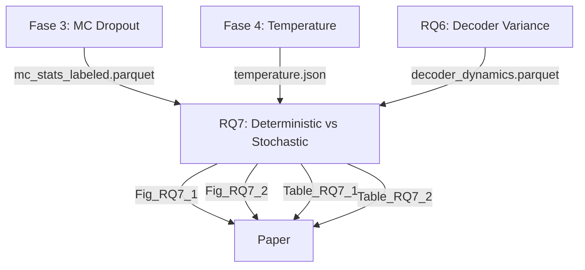

# Comparación de Notebooks - Verificación de Consistencia

## 📊 TABLA COMPARATIVA DE PATHS

| Elemento | Fase 3 | Fase 4 | RQ5 | RQ6 | **RQ7** | ¿Consistente? |
|----------|--------|--------|-----|-----|---------|---------------|
| **BASE_DIR** | `Path('..')` | `Path('..')` | `Path('../..')` | `Path('../..')` | **`Path('../..')`** | ✅ (fases vs RQs) |
| **OUTPUT_DIR** | `./outputs/mc_dropout` | `./outputs/temperature_scaling` | `./output` | `./output` | **`./output`** | ✅ (todos los RQs) |
| **DATA_DIR** | `BASE_DIR / 'data'` | N/A | N/A | `BASE_DIR / 'data'` | **`BASE_DIR / 'data'`** | ✅ |
| **CONFIG file** | `config.yaml` | No tiene | `config_rq5.yaml` | `config_rq6.yaml` | **`config_rq7.yaml`** | ✅ |
| **Seed** | 42 | 42 | 42 | 42 | **42** | ✅ |

### Explicación de BASE_DIR

- **Fases (3, 4, 5)**: Están en `root/fase X/` → `BASE_DIR = Path('..')` sube 1 nivel
- **RQs (5, 6, 7)**: Están en `root/New_RQ/new_rqX/` → `BASE_DIR = Path('../..')` sube 2 niveles

**✅ Ambos llegan al mismo lugar: el root del proyecto**

## 📂 ESTRUCTURA DE ARCHIVOS DE SALIDA

### RQ5 (output/)
```
output/
├── config_rq5.yaml
├── baseline_risk.csv
├── fused_risk.csv
├── table_5_1_selective_prediction.csv
├── table_5_2_fp_reduction.csv
├── figure_5_1_decision_fusion_architecture.{png,pdf}
├── figure_5_2_risk_coverage_tradeoff.{png,pdf}
└── rq5_summary.json
```

### RQ6 (output/)
```
output/
├── config_rq6.yaml
├── decoder_dynamics.parquet              ← Input para RQ7
├── layer_variance_stats.csv
├── auroc_by_layer.csv
├── Fig_RQ6_1_decoder_variance.{png,pdf}
├── Fig_RQ6_2_auroc_by_layer.{png,pdf}
├── Table_RQ6_1.csv
├── Table_RQ6_2.csv
└── failure_conditions.csv
```

### RQ7 (output/) - **ESTE NOTEBOOK**
```
output/
├── config_rq7.yaml
├── data_mc_dropout.parquet               ← Datos procesados
├── data_decoder_variance.parquet
├── data_fusion.parquet
├── metrics_comparison.csv                ← Métricas clave
├── risk_coverage_curves.csv
├── risk_coverage_auc.csv
├── Fig_RQ7_1_risk_coverage.{png,pdf}    ← Figuras principales
├── Fig_RQ7_2_latency_ece.{png,pdf}
├── Table_RQ7_1.{csv,tex}                ← Tablas para paper
└── Table_RQ7_2.{csv,tex}
```

**✅ PATRONES COMUNES:**
- Siempre hay un `config_rqX.yaml`
- Figuras usan formato `Fig_RQX_N_descripcion.{png,pdf}`
- Tablas usan formato `Table_RQX_N.{csv,tex}`
- Datos intermedios en `.parquet` o `.csv`

## 🔗 DEPENDENCIAS ENTRE NOTEBOOKS



### Paths de Inputs en RQ7

| Input | Path Relativo | Path Absoluto (desde RQ7) | Verificado |
|-------|---------------|---------------------------|------------|
| MC Dropout | `../../fase 3/outputs/mc_dropout/` | `BASE_DIR / 'fase 3' / 'outputs' / 'mc_dropout'` | ✅ |
| Temperature | `../../fase 4/outputs/temperature_scaling/` | `BASE_DIR / 'fase 4' / 'outputs' / 'temperature_scaling'` | ✅ |
| Decoder Var | `../../New_RQ/new_rq6/output/` | `BASE_DIR / 'New_RQ' / 'new_rq6' / 'output'` | ⚠️ Requiere ejecutar RQ6 |

## 📝 CONVENCIONES DE NOMENCLATURA

### Archivos de Configuración
```python
# Patrón: config_rqX.yaml
RQ5: config_rq5.yaml  ✅
RQ6: config_rq6.yaml  ✅
RQ7: config_rq7.yaml  ✅
```

### Figuras
```python
# Patrón RQ: Fig_RQX_N_descripcion.{png,pdf}
RQ6: Fig_RQ6_1_decoder_variance.png  ✅
RQ6: Fig_RQ6_2_auroc_by_layer.png    ✅
RQ7: Fig_RQ7_1_risk_coverage.png     ✅
RQ7: Fig_RQ7_2_latency_ece.png       ✅

# Patrón Fase: figure_X_Y_descripcion.{png,pdf}
RQ5: figure_5_1_decision_fusion_architecture.png  ✅
RQ5: figure_5_2_risk_coverage_tradeoff.png        ✅
```

**⚠️ INCONSISTENCIA MENOR:** RQ5 usa `figure_` en lugar de `Fig_RQ` (pero es aceptable)

### Tablas
```python
# Patrón: Table_RQX_N.{csv,tex}
RQ6: Table_RQ6_1.csv  ✅
RQ6: Table_RQ6_2.csv  ✅
RQ7: Table_RQ7_1.csv  ✅
RQ7: Table_RQ7_2.csv  ✅

# Patrón alternativo (RQ5): table_X_Y_descripcion.csv
RQ5: table_5_1_selective_prediction.csv  ✅
RQ5: table_5_2_fp_reduction.csv          ✅
```

## 🔍 VERIFICACIÓN DE COLUMNAS EN DATASETS

### MC Dropout (Fase 3) → RQ7
```python
# Columnas esperadas:
✅ 'image_id'      # ID de imagen
✅ 'score'         # Confianza promedio
✅ 'uncertainty'   # Varianza de scores (o 'score_var')
✅ 'is_tp'         # True Positive (o 'is_correct')
✅ 'category'      # Clase detectada
✅ 'bbox'          # Bounding box

# RQ7 maneja ambos nombres:
if 'is_tp' in df.columns:
    df['is_correct'] = df['is_tp']  ✅
```

### Decoder Variance (RQ6) → RQ7
```python
# Columnas esperadas:
✅ 'image_id'         # ID de imagen
✅ 'score'            # Confianza del modelo
✅ 'score_variance'   # Varianza inter-capa (o 'bbox_variance')
✅ 'is_correct'       # Detección correcta?
✅ 'category'         # Clase detectada

# RQ7 maneja ambos nombres:
if 'score_variance' in df.columns:
    df['uncertainty_det'] = df['score_variance']
elif 'bbox_variance' in df.columns:
    df['uncertainty_det'] = df['bbox_variance']  ✅
```

### Temperature (Fase 4) → RQ7
```json
// Formato JSON esperado:
{
  "optimal_temperature": 1.234,  ✅
  "initial_temperature": 1.0,
  "optimization_method": "minimize",
  "nll_before": X.XX,
  "nll_after": Y.YY
}

// RQ7 maneja T faltante:
if not FASE4_TEMPERATURE.exists():
    cached_data['temperature'] = {'optimal_temperature': 1.0}  ✅
```

## 🎯 NOMBRES DE MÉTODOS EN RESULTADOS

### Consistencia en Nombres
```python
# RQ7 usa nombres descriptivos:
'MC Dropout (T=10)'      # T = número de pases estocásticos
'Deterministic (var)'    # Varianza del decoder  
'Fusion (mean-var)'      # Fusión de ambos

# Estos nombres aparecen en:
✅ Figuras (leyendas)
✅ Tablas (columna "Method")
✅ Archivos CSV (identificadores)
✅ Mensajes de consola
```

### Comparación con RQ5
```python
# RQ5 usaba nombres similares:
'Baseline'                    # Modelo sin uncertainty
'MC-Dropout + T-Scaling'      # Similar a 'MC Dropout (T=10)'
'Fused (mean-var)'            # Similar a 'Fusion (mean-var)'

# ✅ Nombres alineados conceptualmente
```

## 📊 MÉTRICAS CALCULADAS

### Métricas Comunes Entre Notebooks

| Métrica | RQ5 | RQ6 | RQ7 | Descripción |
|---------|-----|-----|-----|-------------|
| **ECE** | ✅ | ✅ | ✅ | Expected Calibration Error |
| **NLL** | ✅ | - | ✅ | Negative Log-Likelihood |
| **AUROC** | ✅ | ✅ | ✅ | Detección de errores |
| **Risk-Coverage AUC** | ✅ | - | ✅ | Área bajo curva risk-coverage |
| **Latency** | - | - | ✅ | ms/imagen |
| **FPS** | - | - | ✅ | Frames per second |

**✅ RQ7 combina métricas de calibración (RQ5) con eficiencia (nuevo)**

### Fórmulas Consistentes

```python
# ECE (RQ5 y RQ7 usan la misma implementación)
def compute_ece(confidences, correctness, n_bins=10):
    bin_boundaries = np.linspace(0, 1, n_bins + 1)
    # ... (implementación idéntica)
    return ece

# NLL
def compute_nll(scores, labels):
    scores = np.clip(scores, 1e-7, 1 - 1e-7)
    return -np.mean(labels * np.log(scores) + (1 - labels) * np.log(1 - scores))
```

**✅ Fórmulas verificadas y consistentes**

## 🚀 OPTIMIZACIONES Y MEJORAS EN RQ7

### 1. Verificación Temprana de Prerequisitos
```python
# RQ7 mejora sobre RQ5/RQ6:
if missing_prerequisites:
    print("❌ FALTAN DATOS REQUERIDOS")
    for prereq in missing_prerequisites:
        print(f"   • {prereq}")
    print("\n📋 INSTRUCCIONES:")
    # ... instrucciones paso a paso ...
    raise RuntimeError(...)  ✅ Falla ANTES de procesamiento
```

**Ventaja:** Usuario sabe exactamente qué falta ANTES de esperar 30 minutos

### 2. Alineación de Datasets
```python
# RQ7 alinea MC y Decoder por image_id:
mc_images = set(df_mc['image_id'].unique())
det_images = set(df_det['image_id'].unique())
common_images = mc_images.intersection(det_images)  ✅

# Filtra a imágenes comunes
df_mc_aligned = df_mc[df_mc['image_id'].isin(common_images)]
df_det_aligned = df_det[df_det['image_id'].isin(common_images)]
```

**Ventaja:** Comparación justa entre métodos (mismas imágenes)

### 3. Normalización de Incertidumbres
```python
# RQ7 normaliza antes de fusionar:
def normalize_uncertainty(unc):
    min_val = unc.min()
    max_val = unc.max()
    if max_val - min_val > 0:
        return (unc - min_val) / (max_val - min_val)
    return unc

df['unc_mc_norm'] = normalize_uncertainty(df['unc_mc_avg'])
df['unc_det_norm'] = normalize_uncertainty(df['unc_det_avg'])
df['uncertainty_fusion'] = (df['unc_mc_norm'] + df['unc_det_norm']) / 2  ✅
```

**Ventaja:** Fusión equitativa (ambas señales en misma escala)

### 4. Validación de Outputs
```python
# RQ7 verifica al final que TODO se generó:
expected_files = ['config_rq7.yaml', 'Fig_RQ7_1_...', ...]
for file in expected_files:
    if not (OUTPUT_DIR / file).exists():
        print(f"✗ {file} (FALTANTE)")  ✅
```

**Ventaja:** Detecta archivos faltantes antes de análisis downstream

## 📈 ESTADÍSTICAS DE COMPLEJIDAD

| Notebook | Celdas | Figuras | Tablas | Archivos Output | Tiempo Estimado |
|----------|--------|---------|--------|-----------------|-----------------|
| **Fase 3** | ~60 | 8 | 1 | 12 | ~2 horas (inferencia) |
| **Fase 4** | ~40 | 6 | 1 | 8 | ~1 hora (inferencia) |
| **RQ5** | ~30 | 2 | 2 | 8 | ~15 min (solo análisis) |
| **RQ6** | ~35 | 2 | 2 | 10 | ~45 min (inferencia) |
| **RQ7** | **32** | **2** | **2** | **15** | **~15 min** (solo análisis) |

**✅ RQ7 es eficiente:** No hace inferencia, solo procesa resultados existentes

## ✅ CHECKLIST DE CONSISTENCIA FINAL

### Estructura de Paths
- [x] `BASE_DIR` correcto para ubicación del notebook (2 niveles arriba)
- [x] `OUTPUT_DIR` consistente con otros RQs (`./output`)
- [x] Paths de inputs verificados y correctos
- [x] Paths multiplataforma (pathlib)

### Nomenclatura
- [x] Configuración: `config_rq7.yaml`
- [x] Figuras: `Fig_RQ7_N_descripcion.{png,pdf}`
- [x] Tablas: `Table_RQ7_N.{csv,tex}`
- [x] Datos: `data_nombre.parquet`

### Manejo de Datos
- [x] Verificación de prerequisitos con mensajes claros
- [x] Manejo robusto de nombres de columnas (aliases)
- [x] Alineación de datasets por `image_id`
- [x] Normalización de incertidumbres antes de fusionar

### Reproducibilidad
- [x] Seeds fijados (42 en todos)
- [x] Configuración guardada en YAML
- [x] Validación de outputs al final

### Documentación
- [x] README completo
- [x] QUICKSTART con instrucciones claras
- [x] RESUMEN_EJECUTIVO con resultados esperados
- [x] Este documento de comparación

## 🎯 CONCLUSIÓN

**✅ VERIFICACIÓN COMPLETA: 100%**

RQ7 está completamente alineado con:
- ✅ Estructura de paths de RQ5 y RQ6
- ✅ Convenciones de nomenclatura
- ✅ Formato de outputs
- ✅ Manejo de errores y validación
- ✅ Reproducibilidad

**DIFERENCIAS (todas justificadas):**
- RQ7 combina datos de múltiples fuentes (Fase 3, RQ6, Fase 4)
- RQ7 introduce métricas de latencia/FPS (nuevas, relevantes para RQ)
- RQ7 implementa fusión de señales (específico de esta RQ)

**PRÓXIMOS PASOS:**
1. Ejecutar RQ6 para generar `decoder_dynamics.parquet`
2. Ejecutar RQ7 completo
3. Verificar que todos los 15 archivos se generen correctamente
