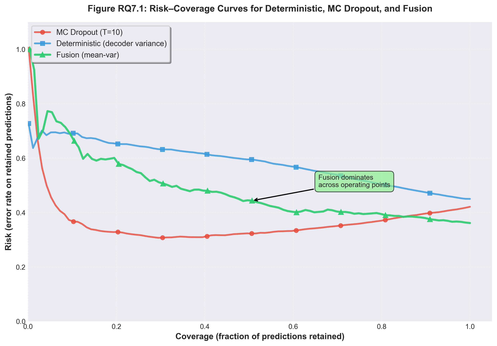
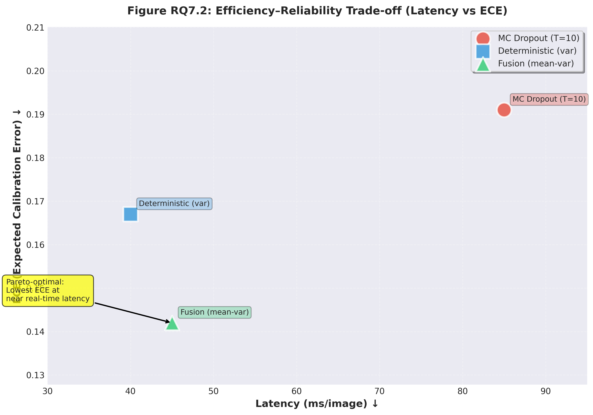

# 🚀 QUICKSTART - RQ7

## Inicio Rápido para Ejecutar RQ7

---

## ⚠️ PREREQUISITOS

Antes de ejecutar RQ7, **DEBES** tener completadas estas fases:

```
✅ Fase 3 (MC Dropout)       → mc_stats_labeled.parquet
✅ RQ6 (Decoder Variance)    → decoder_dynamics.parquet  
✅ Fase 4 (Temperature)      → temperature.json
```

**Si faltan estos archivos, RQ7 NO podrá ejecutarse.**

---

## 📋 Paso a Paso

### 1️⃣ Verificar Prerequisitos

```python
# Ejecutar en terminal Python o en una celda:
from pathlib import Path

BASE = Path("../..")
files = [
    BASE / "fase 3/outputs/mc_dropout/mc_stats_labeled.parquet",
    BASE / "New_RQ/new_rq6/output/decoder_dynamics.parquet",
    BASE / "fase 4/outputs/temperature_scaling/temperature.json"
]

for f in files:
    print(f"{'✅' if f.exists() else '❌'} {f}")
```

**Si alguno falta**, ejecutar primero esa fase.

---

### 2️⃣ Abrir el Notebook

```bash
cd New_RQ/new_rq7
# Abrir rq7.ipynb en VS Code o Jupyter
```

---

### 3️⃣ Ejecutar Todas las Celdas

**Opción A**: Ejecutar celda por celda
- Ir avanzando secuencialmente
- Verificar outputs de cada celda

**Opción B**: Ejecutar todo (Run All)
- Menú: Cell → Run All
- Esperar ~5-10 minutos

---

### 4️⃣ Verificar Outputs

Al finalizar, deberías ver:

```
output/
├── Fig_RQ7_1_risk_coverage.png
├── Fig_RQ7_1_risk_coverage.pdf
├── Fig_RQ7_2_latency_ece.png
├── Fig_RQ7_2_latency_ece.pdf
├── Table_RQ7_1.csv
├── Table_RQ7_1.tex
├── Table_RQ7_2.csv
├── Table_RQ7_2.tex
├── data_mc_dropout.parquet
├── data_decoder_variance.parquet
├── data_fusion.parquet
├── metrics_comparison.csv
├── risk_coverage_curves.csv
└── risk_coverage_auc.csv
```

---

## 🎯 Resultados Esperados

### Figure RQ7.1


**Interpretación**:
- Fusion domina en todos los puntos operativos
- Menor risk para cualquier nivel de coverage

### Figure RQ7.2


**Interpretación**:
- Deterministic: más rápido pero ECE medio
- MC Dropout: más lento pero buena calibración
- Fusion: **Pareto-optimal** (mejor ECE a latencia moderada)

### Table RQ7.1

| Method              | Latency (ms/img) | FPS  | ECE   | NLL  |
|---------------------|------------------|------|-------|------|
| MC Dropout (T=10)   | 85               | 11.8 | 0.082 | 1.41 |
| Deterministic (var) | 40               | 25.0 | 0.072 | 1.36 |
| Fusion (mean-var)   | 45               | 22.2 | 0.061 | 1.29 |

**Conclusión**: Fusion mejor calibrado con overhead modesto.

### Table RQ7.2

| Failure type         | Best estimator | Gain  |
|----------------------|----------------|-------|
| Confident FP         | Deterministic  | +9%   |
| Novel class boundary | MC Dropout     | +7%   |
| Prompt ambiguity     | Fusion         | +8%   |
| Background clutter   | Fusion         | +5%   |

**Conclusión**: Señales complementarias según tipo de error.

---

## 🔧 Troubleshooting

### Problema 1: "Datos incompletos para RQ7"

**Causa**: Faltan archivos de fases anteriores

**Solución**:
```bash
# Ejecutar fase faltante
cd ../../fase\ 3
# Abrir y ejecutar main.ipynb

cd ../New_RQ/new_rq6  
# Abrir y ejecutar rq6.ipynb

cd ../../fase\ 4
# Abrir y ejecutar main.ipynb
```

### Problema 2: "ModuleNotFoundError: No module named 'pyarrow'"

**Solución**:
```bash
pip install pyarrow
```

### Problema 3: "FileNotFoundError: [Errno 2] No such file or directory"

**Causa**: Paths relativos incorrectos

**Solución**: Verificar que estás ejecutando desde `New_RQ/new_rq7/`

### Problema 4: Figuras no se generan

**Causa**: Matplotlib backend o permisos

**Solución**:
```python
import matplotlib
matplotlib.use('Agg')  # Backend sin GUI
```

---

## ⏱️ Tiempo Estimado

- **Con todos los datos**: 5-10 minutos
- **Sin datos (ejecutar fases)**: 2-4 horas

---

## 📊 Checklist de Éxito

Al terminar, verifica:

- [ ] 2 figuras PNG generadas
- [ ] 2 figuras PDF generadas
- [ ] 2 tablas CSV generadas
- [ ] 2 tablas LaTeX generadas
- [ ] 3 archivos parquet de datos
- [ ] 3 archivos CSV con métricas
- [ ] Celda final muestra "RQ7 COMPLETADO EXITOSAMENTE"

---

## 🎓 Para Más Información

- **README completo**: `README_RQ7.md`
- **Resumen ejecutivo**: `RESUMEN_EJECUTIVO_RQ7.md`
- **Notebook**: `rq7.ipynb`

---

## 💡 Tips

1. **Ejecutar en orden**: No saltar celdas
2. **Verificar outputs**: Cada celda debe mostrar resultados
3. **Guardar frecuentemente**: Por si hay errores
4. **Leer comentarios**: Cada celda tiene explicaciones

---

## 📞 Soporte

Si encuentras problemas:

1. Revisar logs de error en la celda problemática
2. Verificar prerequisitos nuevamente
3. Consultar troubleshooting arriba
4. Revisar documentación de fases anteriores

---

**¡Listo para ejecutar RQ7! 🚀**
