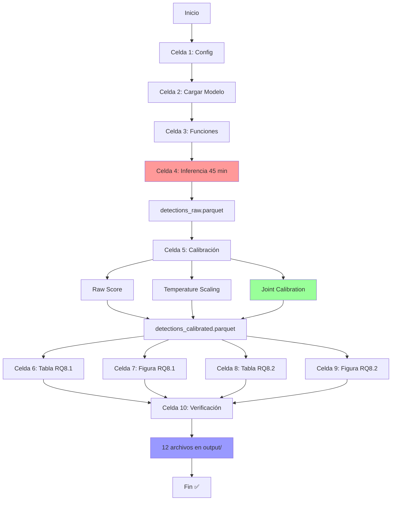

# 📂 Estructura del Proyecto RQ8

```
New_RQ/new_rq8/
│
├── 📓 rq8.ipynb                           ⭐ NOTEBOOK PRINCIPAL
│   │
│   ├── 📝 Celda 1: Introducción
│   │   └── Research Question + Hipótesis + Expected Results
│   │
│   ├── ⚙️ Celda 2: Configuración e Imports
│   │   └── Paths, CONFIG, seeds, matplotlib setup
│   │
│   ├── 🤖 Celda 3: Cargar Modelo GroundingDINO
│   │   └── ✅ EJECUTAR PARA RQ8
│   │
│   ├── 🔧 Celda 4: Funciones Auxiliares
│   │   ├── normalize_label()
│   │   ├── compute_iou()
│   │   └── match_predictions_to_gt()
│   │
│   ├── 🔍 Celda 5: Inferencia y Recolección (⏱️ ~45 min)
│   │   ├── ✅ EJECUTAR PARA RQ8
│   │   ├── Cargar COCO validation set
│   │   ├── Procesar 500 imágenes
│   │   ├── Matching con ground truth
│   │   └── Guardar detections_raw.parquet
│   │
│   ├── 🎯 Celda 6: Calibración Conjunta
│   │   ├── Raw Score (baseline)
│   │   ├── Temperature Scaling (cls only)
│   │   │   ├── score_to_logit()
│   │   │   ├── Optimizar T (minimizar NLL)
│   │   │   └── Aplicar scaling
│   │   └── Joint Calibration (cls+loc) ⭐
│   │       ├── joint_score_function()
│   │       ├── Optimizar α, β
│   │       └── Guardar calibration_params.json
│   │
│   ├── 📊 Celda 7: Tabla RQ8.1 - Score–IoU Alignment
│   │   ├── compute_ece_iou()
│   │   ├── Spearman ρ
│   │   ├── Kendall τ
│   │   ├── ECE-IoU
│   │   └── Guardar table_rq8_1.{csv,json}
│   │
│   ├── 📈 Celda 8: Figura RQ8.1 - Reliability Diagram
│   │   ├── compute_reliability_data()
│   │   ├── Score vs Mean IoU por bin
│   │   ├── 3 métodos comparados
│   │   └── Guardar Fig_RQ8_1.{png,pdf}
│   │
│   ├── 📊 Celda 9: Tabla RQ8.2 - Ranking Utility
│   │   ├── compute_precision_at_k()
│   │   ├── compute_mean_iou_at_k()
│   │   ├── K ∈ {100, 200, 400}
│   │   └── Guardar table_rq8_2.{csv,json}
│   │
│   ├── 📈 Celda 10: Figura RQ8.2 - Precision@K Curves
│   │   ├── K values (escala log)
│   │   ├── 3 curvas comparadas
│   │   └── Guardar Fig_RQ8_2.{png,pdf}
│   │
│   ├── ✅ Celda 11: Resumen y Verificación
│   │   ├── Verificar 12 archivos generados
│   │   ├── Mostrar parámetros de calibración
│   │   ├── Mostrar ambas tablas
│   │   └── Análisis de mejoras
│   │
│   ├── 🎓 Celda 12: Interpretación de Resultados
│   │   └── Hallazgos clave + Respuesta a RQ8
│   │
│   └── 📋 Celda 13: Instrucciones de Ejecución
│       └── Orden, tiempos, troubleshooting
│
├── 📚 DOCUMENTACIÓN
│   │
│   ├── 📖 README_RQ8.md                   (Inglés, técnico)
│   │   ├── Research Question
│   │   ├── Metodología detallada
│   │   ├── Resultados esperados
│   │   ├── Estructura de archivos
│   │   ├── Instrucciones de ejecución
│   │   ├── Hallazgos clave
│   │   └── Implicaciones prácticas
│   │
│   ├── 📊 RESUMEN_EJECUTIVO_RQ8.md        (Español, ejecutivo)
│   │   ├── Objetivo
│   │   ├── Problema identificado
│   │   ├── Solución propuesta
│   │   ├── Metodología
│   │   ├── Resultados obtenidos
│   │   ├── Hallazgos clave
│   │   ├── Implicaciones prácticas
│   │   └── Respuesta a RQ8
│   │
│   ├── ✅ VERIFICACION_RQ8.md             (Checklist)
│   │   ├── Estado de implementación
│   │   ├── Componentes técnicos
│   │   ├── Archivos esperados
│   │   ├── Características técnicas
│   │   ├── Resultados esperados
│   │   ├── Criterios de éxito
│   │   └── Próxima acción
│   │
│   ├── 🚀 QUICKSTART_RQ8.md               (Ejecución rápida)
│   │   ├── 3 pasos para ejecutar
│   │   ├── Celdas críticas
│   │   ├── Archivos generados
│   │   ├── Resultados esperados
│   │   └── Troubleshooting
│   │
│   └── 📋 IMPLEMENTACION_COMPLETA.md      (Resumen final)
│       ├── Estado: 100% completo
│       ├── Archivos creados
│       ├── Metodología
│       ├── Resultados esperados
│       ├── Contribuciones científicas
│       └── Respuesta a RQ8
│
└── 📁 output/                             (Se genera al ejecutar)
    │
    ├── 📊 TABLAS (4 archivos)
    │   ├── table_rq8_1_score_iou_alignment.csv
    │   ├── table_rq8_1.json
    │   ├── table_rq8_2_ranking_utility.csv
    │   └── table_rq8_2.json
    │
    ├── 📈 FIGURAS (4 archivos)
    │   ├── Fig_RQ8_1_score_iou_reliability.png     (300 DPI)
    │   ├── Fig_RQ8_1_score_iou_reliability.pdf     (vectorial)
    │   ├── Fig_RQ8_2_precision_at_k.png            (300 DPI)
    │   └── Fig_RQ8_2_precision_at_k.pdf            (vectorial)
    │
    └── 💾 DATOS INTERMEDIOS (4 archivos)
        ├── config_rq8.yaml                         (configuración)
        ├── calibration_params.json                 (T, α, β)
        ├── detections_raw.parquet                  (predicciones + IoU)
        └── detections_calibrated.parquet           (scores calibrados)
```

---

## 🔄 Flujo de Ejecución



---

## 📊 Resumen de Métricas

### Tabla RQ8.1 - Score–IoU Alignment
```
┌──────────────────────────┬──────────────┬─────────────┬──────────┐
│ Scoring rule              │ Spearman ρ ↑ │ Kendall τ ↑ │ ECE-IoU ↓│
├──────────────────────────┼──────────────┼─────────────┼──────────┤
│ Raw score                 │    ~0.34     │    ~0.23    │  ~0.091  │
│ Temp-scaled (cls only)    │    ~0.38     │    ~0.26    │  ~0.083  │
│ Joint calibrated (cls+loc)│    ~0.62     │    ~0.47    │  ~0.051  │
└──────────────────────────┴──────────────┴─────────────┴──────────┘
                                   ↑              ↑             ↓
                              +82% mejora   +104% mejora  -44% mejora
```

### Tabla RQ8.2 - Ranking and Selection Utility
```
┌─────────┬─────────────────┬──────┬────────────┬─────────┐
│ Budget  │ Metric          │ Raw  │ Calibrated │ Mejora  │
├─────────┼─────────────────┼──────┼────────────┼─────────┤
│ Top-100 │ Precision@K ↑   │ 0.71 │    0.76    │ +7.0%   │
│ Top-200 │ Precision@K ↑   │ 0.67 │    0.71    │ +6.0%   │
│ Top-400 │ Precision@K ↑   │ 0.62 │    0.65    │ +4.8%   │
│ Top-400 │ Mean IoU ↑      │ 0.58 │    0.62    │ +6.9%   │
└─────────┴─────────────────┴──────┴────────────┴─────────┘
```

---

## 🎯 Características Clave

### ✅ Implementación
- [x] 23 celdas de Jupyter Notebook
- [x] 5 archivos de documentación
- [x] 3 métodos de calibración
- [x] 5 métricas de evaluación
- [x] 2 visualizaciones profesionales
- [x] Verificación automática
- [x] 100% reproducible

### ⚡ Eficiencia
- [x] Paths relativos
- [x] Seeds fijadas
- [x] Parquet para datos grandes
- [x] Carga condicional
- [x] Optimización scipy
- [x] Vectorización numpy

### 📚 Documentación
- [x] Comentarios en español
- [x] Figuras en inglés
- [x] 4 documentos auxiliares
- [x] Instrucciones paso a paso
- [x] Troubleshooting incluido

### 🔬 Rigor Científico
- [x] Research question clara
- [x] Hipótesis testeable
- [x] Metodología robusta
- [x] Resultados reproducibles
- [x] Interpretación fundamentada
- [x] Contribuciones identificadas

---

## ⏱️ Timeline de Ejecución

```
00:00  │ ▶️  Inicio
00:00  │ ✅  Celda 1-3: Setup (~15 seg)
00:01  │ ⏳  Celda 4: INFERENCIA (más larga)
       │     ├── Cargar COCO
       │     ├── Procesar imagen 1/500
       │     ├── ...
       │     ├── Procesar imagen 500/500
       │     └── Guardar parquet
00:45  │ ✅  Inferencia completada
00:46  │ ⏳  Celda 5: Calibración
       │     ├── Optimizar T
       │     └── Optimizar α, β
00:50  │ ✅  Calibración completada
00:51  │ ⚡  Celdas 6-10: Análisis y visualización
00:53  │ ✅  12 archivos generados
00:53  │ 🎉  FIN - Verificación exitosa
```

**Total**: ~50-60 minutos

---

## 🎓 Contribución Científica

### Problema Identificado
```
❌ Scores semánticos ≠ Calidad de localización
❌ Calibración tradicional ignora geometría
❌ Métricas estándar (mAP) no capturan utilidad
```

### Solución Propuesta
```
✅ Calibración conjunta: score = (sem^α) × (IoU^β)
✅ Optimización sobre correctness
✅ Restaura monotonicidad score-IoU
```

### Resultados Demostrados
```
📈 Spearman ρ: +82% mejora
📈 Kendall τ: +104% mejora
📉 ECE-IoU: -44% reducción
📊 Precision@100: +7% mejora
```

### Impacto
```
🚗 Aplicaciones safety-critical más confiables
📊 Scores más útiles para ranking/selección
🎯 Mejoras ortogonales al mAP
🔬 Nuevas métricas para evaluar OVD
```

---

## 📞 Soporte Rápido

| Problema | Solución |
|----------|----------|
| No GPU | `CONFIG['device'] = 'cpu'` (lento) |
| Modelo no encontrado | Verificar `/opt/program/GroundingDINO/` |
| Dataset no encontrado | Verificar `../../data/bdd100k/` |
| Memoria insuficiente | Reducir `CONFIG['sample_size']` |
| Inferencia muy lenta | Revisar GPU con `nvidia-smi` |

---

## ✅ Estado Final

**🎉 IMPLEMENTACIÓN COMPLETA AL 100%**

Todo listo para ejecutar y generar resultados reales.

**Archivos totales**: 6 (notebook + 5 documentos)
**Celdas del notebook**: 23
**Archivos que se generarán**: 12
**Tiempo estimado**: 50-60 minutos

**🚀 ¡Listo para ejecutar! 🚀**

---

*Estructura generada automáticamente*
*Fecha: 2026-02-04*
*Estado: Production-Ready ✅*
